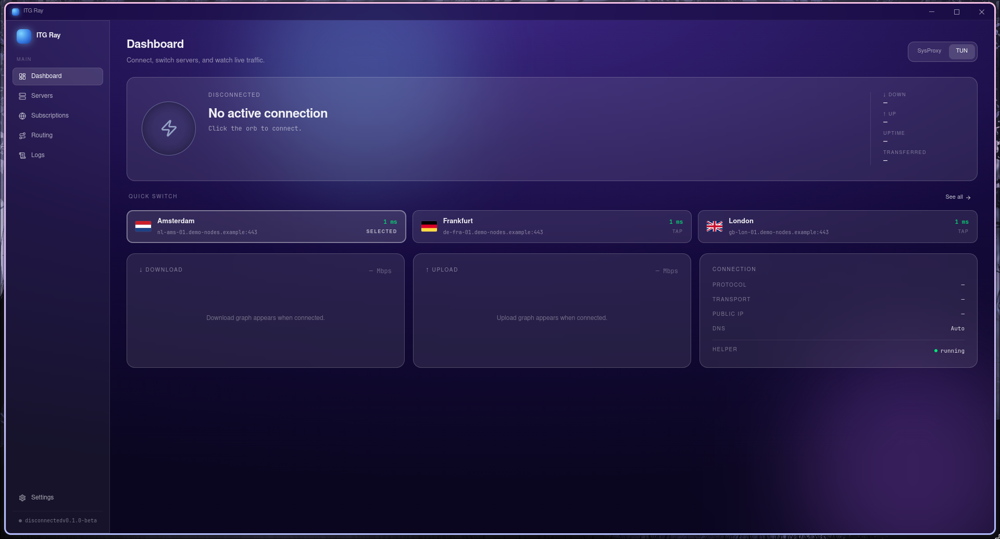
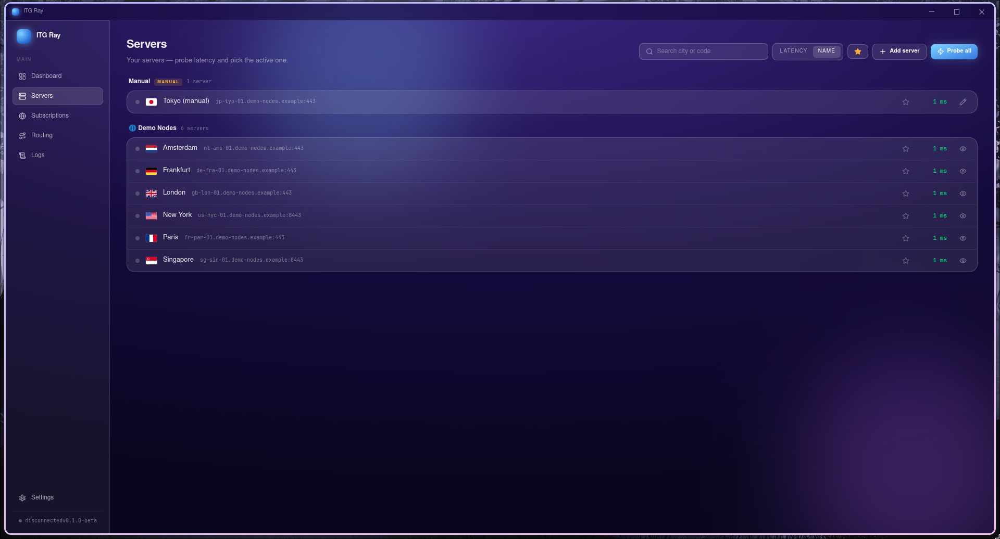
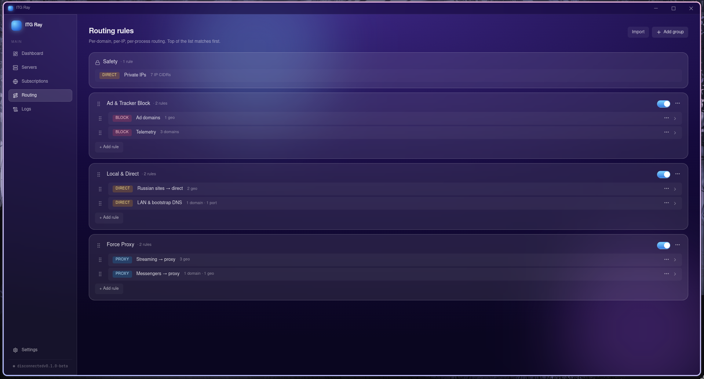

<div align="center">


# ITG Ray

**A fast, modern VLESS VPN client for Linux & Windows.**

Built on [sing-box](https://github.com/SagerNet/sing-box) and [Xray-core](https://github.com/XTLS/Xray-core), wrapped in a clean Electron UI — with a privileged helper so the GUI never runs as root.

[](LICENSE)
[](https://github.com/IvanTopGaming/ITG_Ray/releases)
[](https://github.com/IvanTopGaming/ITG_Ray/releases)
[](https://github.com/IvanTopGaming/ITG_Ray/actions/workflows/ci.yml)

**English** · [Русский](README.ru.md)



</div>

## ✨ Features

| | |
| --- | --- |
| 🌐 **VLESS + subscriptions** | Add servers via `vless://` links or subscription URLs, with auto-refresh. |
| 🛡️ **TUN mode** | System-wide tunneling through a virtual interface with FakeIP DNS. |
| 🧩 **System proxy mode** | Lighter alternative that just sets the OS proxy. |
| 🧭 **Routing rules** | Drag-and-drop editor — domains, IPs, GeoIP/Geosite → proxy / direct / block. |
| 🔌 **Local inbounds** | SOCKS `127.0.0.1:1080` and HTTP `127.0.0.1:8888` stay reachable even in TUN. |
| 📊 **Observability** | Live core logs, traffic stats and latency probing. |
| 🔒 **Privilege-separated** | A root helper owns the tunnel; the GUI talks to it over a local API. |
| 🌍 **Bilingual UI** | English and Russian. |

## 🖼️ Screenshots

<div align="center">

| Servers | Routing rules |
| :---: | :---: |
|  |  |

</div>

<sub>Screenshots use demo servers — real endpoints are not shown.</sub>

## 📦 Install

### 🐧 Linux

- **Arch Linux (AUR)**
  ```bash
  yay -S itgray-bin
  sudo systemctl enable --now itgray-helper.service
  ```
- **AppImage** — grab `ITGRay-<version>.AppImage` from the
  [Releases](https://github.com/IvanTopGaming/ITG_Ray/releases) page, make it
  executable and run. TUN mode needs the bundled helper as a systemd service —
  the AUR / tarball install is recommended for TUN.

### 🪟 Windows

Download and run `ITGRay-Setup-<version>.exe` from the
[Releases](https://github.com/IvanTopGaming/ITG_Ray/releases) page. The installer
registers the helper service and ships the Wintun driver.

## 🔨 Build from source

> Prerequisites: **Go 1.26+**, **Node 22+**, npm. Cross-building the Windows
> installer additionally requires **wine**.

```bash
git clone https://github.com/IvanTopGaming/ITG_Ray
cd ITG_Ray
(cd cmd/itgray-electron && npm ci && cd frontend && npm ci)
bash scripts/build-linux.sh     # AppImage + binaries in dist/
bash scripts/build-windows.sh   # NSIS installer (cross-compiled from Linux)
```

## 🏗️ Architecture

```
┌──────────────┐   IPC    ┌──────────┐  HTTP/unix   ┌─────────────────────────┐
│  Electron UI │ ───────▶ │  bridge  │ ───────────▶ │  itgray-helper (root)   │
└──────────────┘          └──────────┘              │  systemd / win service  │
                                                    └───────────┬─────────────┘
                                                                │ spawns
                                                        sing-box / xray
```

The helper owns everything privileged (TUN interface, routes, DNS). The GUI talks
to it through a local API and can restart independently — **an active tunnel
survives GUI restarts**.

## 📄 License

[GPL-3.0](LICENSE) © IvanTopGaming. Bundled third-party components are listed in
[docs/THIRD_PARTY.md](docs/THIRD_PARTY.md).
