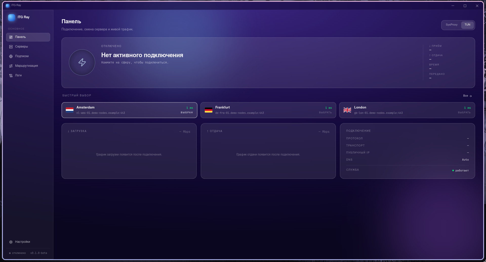
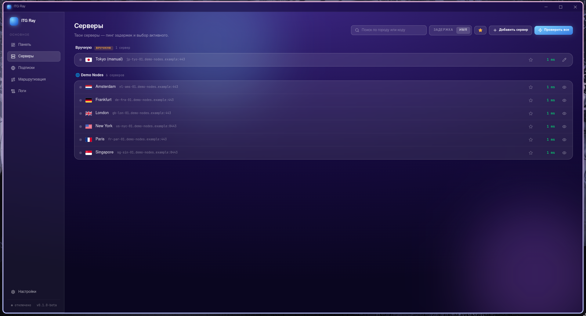
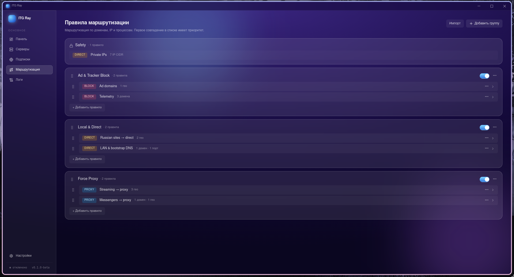

<div align="center">


# ITG Ray

**Быстрый современный VLESS VPN-клиент для Linux и Windows.**

Построен на [sing-box](https://github.com/SagerNet/sing-box) и [Xray-core](https://github.com/XTLS/Xray-core), в аккуратной обёртке Electron — с привилегированным хелпером, чтобы GUI никогда не запускался от root.

[](LICENSE)
[](https://github.com/IvanTopGaming/ITG_Ray/releases)
[](https://github.com/IvanTopGaming/ITG_Ray/releases)
[](https://github.com/IvanTopGaming/ITG_Ray/actions/workflows/ci.yml)

[English](README.md) · **Русский**



</div>

## ✨ Возможности

| | |
| --- | --- |
| 🌐 **VLESS + подписки** | Добавляй серверы по `vless://`-ссылкам или URL подписок, с авто-обновлением. |
| 🛡️ **Режим TUN** | Системный туннель через виртуальный интерфейс с FakeIP DNS. |
| 🧩 **Режим системного прокси** | Лёгкая альтернатива — просто выставляет прокси ОС. |
| 🧭 **Правила маршрутизации** | Drag-and-drop редактор — домены, IP, GeoIP/Geosite → proxy / direct / block. |
| 🔌 **Локальные инбаунды** | SOCKS `127.0.0.1:1080` и HTTP `127.0.0.1:8888` доступны даже в TUN. |
| 📊 **Наблюдаемость** | Живые логи ядер, статистика трафика и замер задержек. |
| 🔒 **Разделение привилегий** | Root-хелпер владеет туннелем; GUI общается с ним по локальному API. |
| 🌍 **Двуязычный интерфейс** | Английский и русский. |

## 🖼️ Скриншоты

<div align="center">

| Серверы | Правила маршрутизации |
| :---: | :---: |
|  |  |

</div>

<sub>На скриншотах — демо-серверы, реальные адреса не показаны.</sub>

## 📦 Установка

### 🐧 Linux

- **Arch Linux (AUR)**
  ```bash
  yay -S itgray-bin
  sudo systemctl enable --now itgray-helper.service
  ```
- **AppImage** — скачай `ITGRay-<version>.AppImage` со страницы
  [Releases](https://github.com/IvanTopGaming/ITG_Ray/releases), сделай
  исполняемым и запусти. Режиму TUN нужен хелпер как systemd-сервис — для TUN
  рекомендуется установка через AUR / tarball.

### 🪟 Windows

Скачай и запусти `ITGRay-Setup-<version>.exe` со страницы
[Releases](https://github.com/IvanTopGaming/ITG_Ray/releases). Установщик
регистрирует сервис хелпера и кладёт драйвер Wintun.

## 🔨 Сборка из исходников

> Требуется: **Go 1.26+**, **Node 22+**, npm. Для кросс-сборки установщика
> Windows дополнительно нужен **wine**.

```bash
git clone https://github.com/IvanTopGaming/ITG_Ray
cd ITG_Ray
(cd cmd/itgray-electron && npm ci && cd frontend && npm ci)
bash scripts/build-linux.sh     # AppImage + бинарники в dist/
bash scripts/build-windows.sh   # NSIS-установщик (кросс-сборка с Linux)
```

## 🏗️ Архитектура

```
┌──────────────┐   IPC    ┌──────────┐  HTTP/unix   ┌─────────────────────────┐
│  Electron UI │ ───────▶ │  bridge  │ ───────────▶ │  itgray-helper (root)   │
└──────────────┘          └──────────┘              │  systemd / win service  │
                                                    └───────────┬─────────────┘
                                                                │ spawns
                                                        sing-box / xray
```

Хелпер владеет всем привилегированным (TUN-интерфейс, маршруты, DNS). GUI
общается с ним по локальному API и может перезапускаться независимо —
**активный туннель переживает перезапуск GUI**.

## 📄 Лицензия

[GPL-3.0](LICENSE) © IvanTopGaming. Сторонние компоненты перечислены в
[docs/THIRD_PARTY.md](docs/THIRD_PARTY.md).
